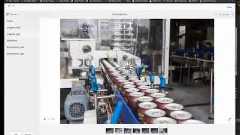

# [!DNL Experience Manager] Grabaciones de Skills Builder

Bienvenido al Adobe [!DNL Experience Manager] Inicio de Skill Builder Recordings. Se trata de seminarios web grabados diseñados para crear su base de conocimientos y maximizar su inversión en Adobes [!DNL Experience Manager].

## Novedades

<table>
<tr>
  <td>
    
    

      <a href="https://experienceleague.adobe.com/docs/experience-manager-skill-builder/skill-builder/2020/asset-link.html">
    <strong>[!DNL Asset Link]</strong>
    </a>
    

    

    <em>[!DNL Asset Link] es su conexión nativa con Adobe Creative Cloud.</em>
    

  </td>
  <td>
    
    

    <a href="https://experienceleague.adobe.com/docs/experience-manager-skill-builder/skill-builder/2020/brand-portal.html">
    <strong>Brand Portal</strong>
    </a>
    

    

    <em>Fácil uso compartido de recursos con equipos internos y externos.</em>
    

  </td>
  <td>
    
     

      <a href="https://experienceleague.adobe.com/docs/experience-manager-skill-builder/skill-builder/2020/dynamic-media.html">
        <strong>[!DNL Dynamic Media]</strong>
      </a>
    

    

    <em>Automatice la salida de recursos para todos los canales y pantallas.</em>
    

  </td>
</tr>
</table>

>[!TIP]
>
>**Consulte la navegación de la izquierda para ver las grabaciones de eventos anteriores del Generador de habilidades**.
